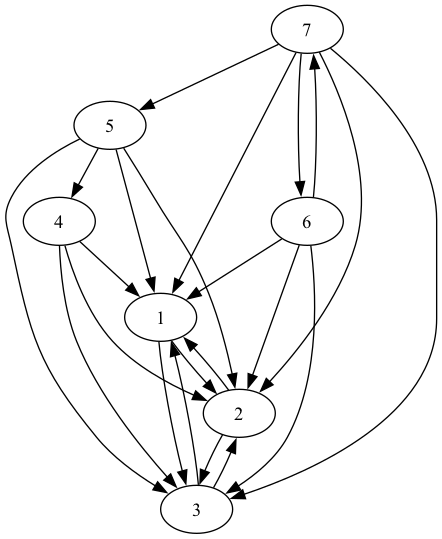

# PFAD Chapter 9 in Rust

This repository contains Rust implementations of various algorithms inspired by the book:

- **Title**: *Pearls of Functional Algorithm Design*
- **Author**: Richard Bird
- **Publisher**: Cambridge University Press
- **ISBN**: 9780511763199

# Output sample
{1, 2, 3} is the celebrity clique.

